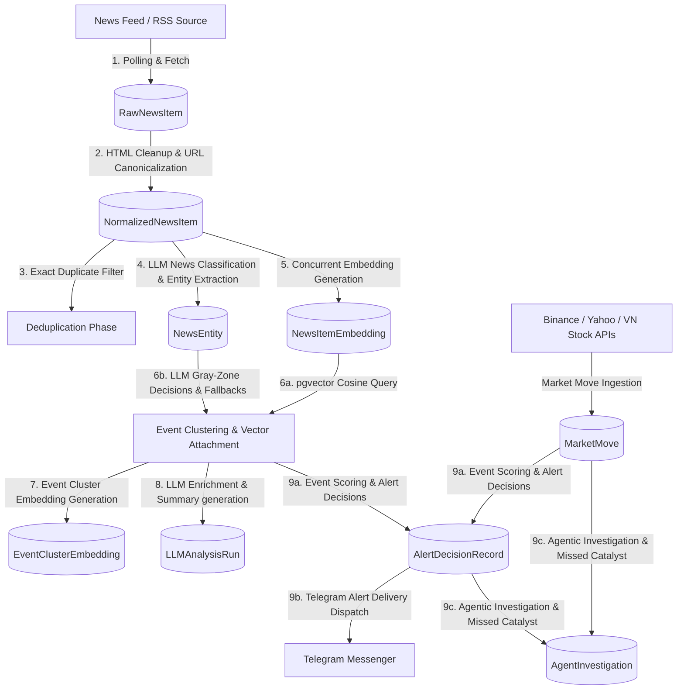

# `market-watch-bot` MVP Final - Implementation Recap & Progress

**Target Code Base State / Commit ID**: `c9f2f2d0bf95400c41013f23d347aab832b7dc39`

The `market-watch-bot` is now fully realized as a production-grade, modular, standalone background service and CLI worker. It is responsible for ingestion, normalization, exact duplicate filtering, semantic clustering, high-performance database storage, and advanced scoring. It combines deterministic data pipelines with high-value, robust agentic/LLM operations—culminating in immediate Telegram alert delivery and recursive search-powered agent investigations.



---

## 1. Core Component Layering

The codebase has been refactored and modularized into logical subpackages to prepare for scaling and decoupled dashboard/API integrations. The new structure in `bot_worker/` is organized as follows:

*   **`bot_worker/db/`**: Database connections, session context managers, and relational entities.
    *   `models.py`: Defines the SQLAlchemy models (Postgres + `pgvector` compatibility) of the core schemas, now fully expanded with alert deliveries, agent investigations, and LLM run caches.
    *   `session.py`: Async connection pool helpers and transactions.
*   **`bot_worker/cli/`**: Subpackaged Typer command routing for robust administration.
    *   `apps.py` / `core.py` / `common.py`: Centrally handles contexts, global configuration overrides, and standardized JSON reporting.
    *   Topic-specific modules: `source.py`, `worker.py`, `pipeline.py`, `news.py`, `events.py`, `watchlist.py`, `alerts.py`, `digests.py`, `retention.py`, `health.py`, `embeddings.py`, `market.py`, `catalysts.py`, `llm.py`, and `investigate.py`.
*   **`bot_worker/services/`**: Subpackaged, decoupled core service orchestration layers.
    *   `pipeline.py`: Orchestrates the 9 stages of the market-watch data engine.
    *   `llm.py`: Manages structured LLM analysis, classifications, gray-zone judgments, and entity extractions via OpenRouter.
    *   `investigation.py`: Orchestrates agentic research loops using Brave Search and local database contexts.
    *   `alert_delivery.py`: Connects alert decisions to downstream notification channels (Telegram API).
    *   `events.py` / `sources.py` / `watchlists.py` / `embeddings.py` / `digests.py` / `market.py` / `retention.py` / `jobs.py`: Specific backend managers that separate business logic from the database schema and CLI triggers.
*   **Utility modules**:
    *   `config.py`: Enriched with settings parsers for custom hyperparameters (concurrency levels, threshold values, and timeouts).
    *   `normalize.py`: Query-param-aware URL canonicalization, HTML stripping, and text formatting.
    *   `rss.py`: Asynchronous RSS and XML parsing adapters.
    *   `watchlist.py`: A case-insensitive substring engine mapping entities to Tier A-D priorities.
    *   `embeddings.py`: Abstracts the remote OpenRouter embeddings and the offline-first character hash provider.
    *   `logging.py`: A line-count-aware log rotator (`LineRotatingFileHandler`).

---

## 2. Step-by-Step Pipeline Execution Flow

When `market-watch pipeline run` executes, it triggers the orchestration in `services/pipeline.py` which coordinates **9 highly robust stages**:

### Stage 1: News Source Polling
1. Reads active `NewsSource` records from the database.
2. Performs asynchronous HTTP requests to parse their XML feeds via `rss.py` inside `services/sources.py`.
3. Hashes parsed elements (`title + description + url`) to create a unique `content_hash`.
4. Saves new items into `RawNewsItem`, skipping duplicates using a database `UniqueConstraint` on `(source_id, content_hash)`.
5. Logs fetch duration, outcomes, and item counts to `SourceFetchLog`.

### Stage 2: Normalization
1. Selects pending `RawNewsItem` rows.
2. Strips HTML tags, unescapes entities, collapses white space, and normalizes text structure to `NFKC` unicode formats.
3. Canonicalizes URLs by lower-casing domain paths and dropping common tracking parameters (e.g., `utm_*`, `fbclid`).
4. Ensures publication timestamps are timezone-aware UTC and filters out items older than `freshness_hours`.
5. Inserts records into `NormalizedNewsItem` with processing status `"normalized"`.

### Stage 3: Exact Deduplication
1. Compares newly normalized articles.
2. Identifies exact duplicates using `(canonical_url_hash, title_hash)` signatures.
3. Marks duplicate records with the status `"deduped"` to avoid redundant embedding generation while maintaining volume weights for event clusters.

### Stage 4: LLM-Based Entity Extraction & Classification
If an LLM configuration is active and enabled:
1. Selects pending normalized news items.
2. Formulates structured classification requests via OpenRouter (e.g., `openai/gpt-4o-mini`).
3. Classifies the news type and extracts highly accurate geographic regions, affected asset classes, raw text entities, and tickers.
4. Spawns corresponding `NewsEntity` records in the database, allowing highly intelligent tracking that goes beyond simple keyword matches.

### Stage 5: Generating News Embeddings
1. Takes normalized items that lack vector mappings.
2. Formulates semantic texts containing title, snippet, source context, and extracted entities.
3. Generates 1536-dimensional representation:
    * **`OpenRouterEmbeddingProvider`**: Accelerates vector generation by executing HTTP requests concurrently in highly optimized batches (`max_concurrency` defaults to `3`).
    * **`LocalEmbeddingProvider`**: An offline-first character-hash fallback model that requires no network connections, enabling quick dry-runs and robust offline unit testing.
4. Persists vectors to `NewsItemEmbedding` using standard Postgres `pgvector` drivers.

### Stage 6: Event Clustering with Vector Attachment & LLM Gray Zone Decision Logic
Attempts to attach incoming news items to existing event clusters using a multi-tiered approach:
1. **Vector attachment search**: Queries recent event clusters within `cluster_attach_lookback_days` using the incoming news embedding and `pgvector` cosine similarity.
2. **Compatibility gates**: Candidates meeting `cluster_attach_min_similarity` (default `0.88`) are evaluated against strict asset-class, region, and entity compatibility rules. If compatible, the item attaches immediately, merging entities and resetting the cluster's scores.
3. **LLM Gray-Zone Decisions**: If a vector candidate similarity score falls in the "gray zone" (between `0.78` and `0.88`), the system calls an LLM (`resolve_llm_cluster_decision`) to resolve semantic ambiguity. The LLM judges whether the item represents the `same_event`, a `related_but_separate` update, or a `different_event`.
4. **Deterministic Fallback**: If vector attachment is disabled or no candidate matches, the pipeline groups remaining items using entity matching and high-performance `SequenceMatcher` text ratios to form new `EventCluster` drafts.

### Stage 7: Generating Event Embeddings
1. Scans for new `EventCluster` records or updated clusters whose embeddings were purged due to new news item attachments.
2. Formulates structured contexts from canonical headlines, summaries, asset classes, and affected entities.
3. Generates and stores 1536-dimensional representations in `EventClusterEmbedding`.

### Stage 8: LLM Event Enrichment & "Why It Matters" Analysis
If an LLM configuration is active:
1. Evaluates clusters meeting priority threshold triggers:
    * **High deterministic score**: `final_score >= high_score_threshold` (default `80`).
    * **Single-source high impact**: `source_score >= single_source_score_threshold` (default `90`).
    * **Unexplained price moves**: Matches significant price actions but has lower initial news volume.
    * **Relevance triggers**: Matches Tier A/B watchlists with high source scores.
2. Generates an LLM analysis via OpenRouter that extracts:
    * Factual event summaries.
    * Factual assessment status, risk flags, and digest bullet points.
    * Premium **"Why it matters"** details.
    * A curated, high-impact **Telegram alert message**.
    * A bounded **`score_modifier`** (from `-10` to `+10`) to adjust deterministic scores based on qualitative context.
3. Caches the transaction in `LLMAnalysisRun` to prevent redundant api calls.

### Stage 9: Scoring, Alert Decisions, Agentic Investigations & Telegram Alert Dispatching
1. Joins recent price changes from `MarketMove` within a $\pm24$-hour window to the event cluster.
2. Calculates the final score by combining deterministic weights (source, impact, relevance, novelty, urgency, price action) and the LLM's qualitative `score_modifier`.
3. Selects the dispatch level based on threshold policies:
    * `final_score >= 80`: Immediate alert.
    * `final_score >= 55`: Watchlist batch summary.
    * `final_score >= 30`: Daily digest archive.
    * `final_score < 30`: Silent archive.
4. **Agentic Investigations**: Automatically queues and executes agent investigations for highly uncertain, high-impact event clusters or missed price moves (Stage 9c).
5. **Telegram Alert Delivery Dispatch**: Reads pending decisions marked as `immediate_alert`. Formulates a beautifully structured markdown message containing the LLM-curated alert headline, status, affected assets, time ranges, and "Why it matters". Delivers the notification to the target chat ID and records the outcome in `AlertDeliveryRecord` (Stage 9b).

---

## 3. Advanced Supplementary Bot Workflows

### A. Constrained Agentic Investigation System
Located in `services/investigation.py` and triggered via the `market-watch investigate` command group, the Agentic Investigator handles complex, highly uncertain events:
1. **Evidence Gathering**: Gathers context evidence from two robust dimensions:
    * **Local news context**: Scans the PostgreSQL database for highly relevant, recently normalized news items based on asset symbols, entities, and keyword matching.
    * **Live search evidence**: If a `BraveSearchClient` API key is configured, it queries the live web for official announcements, financial filings, or regulatory statements.
2. **Ranked Uniqueness filtering**: Ranks search result snippets using a quality matrix (`official` > `high_quality` > `media` > `unknown`) and filters out duplicate URLs and domains.
3. **Structured LLM Investigation Chain**: Submits the gathered evidence to an LLM chain. The LLM judges the credibility of rumors, checks for official regulatory confirmations, flags market risks, suggests score modifiers, and outputs suggested alert levels.
4. **Failure Resilience**: Live search and API connections fail gracefully, ensuring that database updates and deterministic scoring flows remain operational even if external APIs time out.

### B. Missed Catalyst Review & Auto-queueing
Scans the `MarketMove` table for significant price actions (Z-score $\ge 70$) that have no corresponding news event clusters registered within a $\pm24$-hour window. It creates a `MissedCatalystReview` record, which automatically queues an Agent Investigation to perform web searches and discover why the asset moved.

### C. Dynamic Log Rotation
As implemented in `bot_worker/logging.py`, a custom `LineRotatingFileHandler` restricts runtime logs to a configured line count (default `10000` lines) rather than raw bytes, ensuring developers can easily read logs without running out of disk space.

### D. Age-Based Data Retention & Vacuuming
Cleans outdated database entries based on configurable windows in `settings.yml` (e.g., deleting fetch logs after 14 days, raw news items after 60 days, and alert decisions after 365 days). Running `market-watch retention run` executes these purges, maintaining low database overhead.

### E. Baseline Data Reset
The CLI includes a destructive command `market-watch init --reset` (as well as dedicated command-line utilities) that purges all tables and migrations, enabling developers to perform clean seedings and reset baseline data instantly.

---

## 4. Current DB Relational Layout

The final relational database layout maps all entities, including the newly added alert deliveries, agent investigations, and LLM cache tables:

```
                            ┌───────────────┐
                            │  NewsSource   │◄────────────────┐
                            └──────┬────────┘                 │
                                   │                          │
                       ┌───────────┴───────────┐              │
                       ▼                       ▼              │
               ┌───────────────┐       ┌───────────────┐      │
               │SourceFetchLog │       │  RawNewsItem  │      │
               └───────────────┘       └───────┬───────┘      │
                                               │              │
                                               ▼              │
                                       ┌───────────────┐      │
                                       │NormalizedItem ├──────┘
                                       └──────┬─┬──────┘
                                              │ │
                       ┌──────────────────────┘ └──────────────────────┐
                       ▼                                               ▼
               ┌───────────────┐                               ┌───────────────┐
               │NewsItemEmbed  │                               │  NewsEntity   │
               └───────────────┘                               └───────┬───────┘
                                                                       │
                ┌───────────────┐                                      ▼
                │  MarketMove   │                              ┌───────────────┐
                │  Timestamp    ├─────────────────────────────►│WatchlistEntity│
                └──────┬────────┘                              └───────────────┘
                       │
                       │              ┌───────────────┐
                       │              │ EventCluster  │◄────────┐
                       │              └────┬──────┬───┘         │
                       │     ┌─────────────┘      │             │
                       ▼     ▼                    ▼             │
               ┌───────────────┐       ┌───────────────┐        │
               │MissedCatalyst │       │LLMAnalysisRun │        │
               └───────┬───────┘       └───────────────┘        │
                       │                                        │
                       ▼                                        │
               ┌───────────────┐       ┌───────────────┐        │
               │AgentInvestigtn│       │EventClusterEmb│        │
               └───────────────┘       └───────────────┘        │
                                                                │
                                       ┌───────────────┐        │
                                       │EventClusterItm├────────┘
                                       └───────┬───────┘
                                               │
                                               ▼
                                       ┌───────────────┐
                                       │AlertDecision  │◄────────┐
                                       └───────┬───────┘         │
                                               │                 │
                                               ▼                 │
                                       ┌───────────────┐         │
                                       │AlertDelivery  ├─────────┘
                                       └───────────────┘
```

---

## 5. High-Performance Vector Indexes & Production Settings

### Optimized pgvector Query Indexes
The database is equipped with high-efficiency indexes to support rapid vector lookups during the Stage 5 and Stage 6 clustering pipelines:
*   **`ix_event_cluster_embeddings_vector_hnsw_cosine`**: An HNSW index on `event_cluster_embeddings(vector)` utilizing `vector_cosine_ops` to enable rapid semantic similarity querying.
*   **`ix_event_cluster_embeddings_model_filter`**: A composite btree index on `(provider, embedding_model, embedding_version, dimensions)` to filter cluster embedding candidates rapidly before conducting vector comparisons.

### Hyperparameters Config (`settings.yml`)
The core configuration file has been enriched with control variables to tune the pipeline, LLM limits, and agent behaviors:
```yaml
embeddings:
  cluster_attach_enabled: true             # Enable vector attachment search
  cluster_attach_lookback_days: 7          # Max age of existing clusters to scan
  cluster_attach_min_similarity: 0.88      # Minimum cosine similarity cutoff
  cluster_attach_candidate_limit: 20       # Max candidate clusters to evaluate for compatibility

llm:
  enabled: true                            # Enable LLM integration
  provider: "openrouter"
  model: "openai/gpt-4o-mini"
  prompt_version: "event-v1"
  temperature: 0.1
  max_concurrency: 3                       # Concurrency semaphore for async requests
  cluster_decision_enabled: true           # Enable LLM-based gray-zone clustering
  cluster_ambiguous_min_similarity: 0.78  # Ambiguity floor for LLM cluster matching
  cluster_decision_min_confidence: 70      # Confidence filter for LLM attachments
  cluster_decision_candidate_limit: 3      # Max candidates to send to LLM per item

investigation:
  enabled: true                            # Enable Agentic Investigations
  local_evidence_lookback_days: 3          # Local DB evidence lookback
  local_evidence_limit: 5                  # Max news items to extract from local DB
  max_search_results: 4                    # Max search results per Brave query
  max_evidence_items: 8                    # Total combined evidence ceiling
  max_modifier: 10                         # Bounded score ceiling
  min_modifier: -10                        # Bounded score floor
```

---

## 6. Comprehensive State Review

This section evaluates the completed `market-watch-bot` codebase against the target architectural designs and CLI specifications.

### 6.1 Architectural & Data Pipeline Review
All target features outlined in the product brief are **100% complete and fully implemented**.

| Component | Final Implementation Status | Code Location | Key Features |
| :--- | :--- | :--- | :--- |
| **Source Registry** | **Implemented** | `db/models.py` | Models weights, enabled toggles, and customized polling intervals. |
| **RSS Collector** | **Implemented** | `rss.py`, `services/sources.py` | Parses feeds asynchronously, records logs, and handles encoding standardizations. |
| **Raw Ingestion Store**| **Implemented** | `db/models.py` | Unique payload hashing to filter exact raw items at the database boundary. |
| **Normalizer** | **Implemented** | `normalize.py` | Sanitizes URLs, cleans HTML entities, and standardizes timezone-aware timestamps. |
| **Exact Deduper** | **Implemented** | `services/ingestion.py` | Uses dual URL and title hashes to tag exact duplicate stories as `"deduped"`. |
| **Entity Extractor** | **Implemented** | `watchlist.py`, `services/llm.py` | Combines deterministic watchlist matches with advanced LLM entity extraction. |
| **Vector Embeddings** | **Implemented** | `embeddings.py`, `services/embeddings.py` | Implements concurrent batching for OpenRouter and provides an offline fallback. |
| **Event Clustering** | **Implemented** | `services/events.py` | Combines pgvector cosine queries, deterministic fallbacks, and LLM gray-zone matching. |
| **Market Data Join** | **Implemented** | `market_data.py`, `services/market.py` | Collects local and global market price actions to calculate catalyst scores. |
| **Scoring Engine** | **Implemented** | `scoring.py` | Calculates multidimensional weights and applies penalties and catalyst boosts. |
| **Alert Decisions** | **Implemented** | `services/alerts.py` | Determines escalation levels and archives historical scores. |
| **Alert Delivery** | **Implemented** | `services/alert_delivery.py` | Formulates alert layouts and dispatches notification items directly to Telegram. |
| **Retention Jobs** | **Implemented** | `services/retention.py` | Cleans logs, raw text, and obsolete vectors according to retention configurations. |
| **Agentic Investigator**| **Implemented** | `services/investigation.py` | Gathers local news and queries the live web to solve catalyst questions. |
| **LLM Enrichment** | **Implemented** | `services/llm.py` | Generates "Why it matters" briefs and calculates qualitative modifiers. |

---

### 6.2 CLI Namespace Completion Analysis
The Typer executable at `bot_worker/cli/` has been completely subpackaged. This section evaluates the exact state of all commands and subcommands compared to the target CLI manual, separating them into **Fully Implemented**, **MVP Placeholder/Stub**, and **Missing/Omitted**:

#### Setup & Diagnostics
*   `market-watch init`: **Fully Implemented**. Generates starter configurations (`.env`, `settings.yml`, `starter-sources.yml`).
*   `market-watch migrate`: **Fully Implemented**. Upgrades Alembic schemas and seeds base data.
*   `market-watch doctor`: **Fully Implemented**. Audits Postgres reachability, `pgvector` presence, and OpenRouter API keys.

#### Source Management
*   `market-watch source add` / `list` / `show` / `test` / `fetch` / `enable` / `disable` / `purge` / `import` / `export`: **Fully Implemented**. Provides complete lifecycle control and YAML import/export.

#### Worker & Job Execution
*   `market-watch worker start` / `health`: **Fully Implemented**. Loops `run_pipeline` and pending investigations.
*   `market-watch worker status` / `logs`: **Implemented**. Shows latest job-run state and tails the local log file when present.
*   `market-watch worker stop` / `restart`: **Intentionally omitted**. Use terminal signals, Docker, systemd, or another process manager.
*   `market-watch job list`: **Fully Implemented**.
*   `market-watch job run`: **Implemented for direct jobs**. Runs `"pipeline"` and `"retention_cleanup"`; registered pipeline stages without direct runners fail clearly.
*   `market-watch job history` / `failures`: **Fully Implemented**. Reads `job_runs` history and failure records.
*   `market-watch job retry` / `show` / `enable` / `disable`: **Intentionally omitted**.
*   `market-watch pipeline run` / `stats`: **Fully Implemented**. Orchestrates 9 stages.
*   `market-watch pipeline inspect`: **Fully Implemented**. Inspects raw news, normalized news, events, alerts, and investigations.
*   `market-watch pipeline replay`: **Intentionally omitted**.

#### Data Browsing & Watchlists
*   `market-watch news list` / `show` / `search` / `entities`: **Fully Implemented**. Provides database-backed news inspection, entity display, embedding status, and cluster membership.
*   `market-watch news similar`: **Intentionally omitted**.
*   `market-watch event list` / `show` / `merge` / `rescore` / `recluster` / `mark`: **Fully Implemented**. Merge requires `--confirm`.
*   `market-watch event search` / `similar` / `split`: **Intentionally omitted**.
*   `market-watch watchlist add` / `list` / `match`: **Fully Implemented**. Adds keywords and tests matching terms.
*   `market-watch watchlist show` / `update` / `remove` / `import` / `export`: **Fully Implemented**.

#### Alerts & Digests
*   `market-watch alert policy show` / `test` / `send-test` / `dispatch` / `list` / `show` / `channel show`: **Fully Implemented**. Dispatches direct immediate alert runs and tests over Telegram; audits delivery logs.
*   `market-watch alert policy set` / `policy reset`: **Intentionally omitted from the recommended CLI**. Persistent edits stay in `settings.yml`.
*   `market-watch alert send` / `suppress` / `unsuppress`: **Intentionally omitted**.
*   `market-watch digest preview` / `build`: **Fully Implemented**. Compiles chronological timelines.
*   `market-watch digest history`: **Intentionally omitted** until durable digest records exist.
*   `market-watch digest send`: **Intentionally omitted** until durable digest delivery exists.

#### Vectors, LLM & Agentic Investigation
*   `market-watch embedding backfill` / `status` / `search`: **Fully Implemented**. Uses the existing `embedding` namespace instead of a duplicate `vector` namespace.
*   `market-watch embedding embed` / `reembed` / `rebuild`: **Intentionally omitted**.
*   `market-watch llm test` / `classify` / `enrich` / `summarize` / `score` / `usage`: **Fully Implemented**. Executes manual LLM analysis runs and outputs token metrics.
*   `market-watch investigate event` / `asset` / `move` / `pending` / `run-pending` / `show`: **Fully Implemented**. Executes Brave-powered search and database evidence LLM investigation runs.
*   `market-watch market fetch` / `move` / `movers` / `join`: **Fully Implemented**.
*   `market-watch market source add` / `list`: **Intentionally omitted**.
*   `market-watch catalyst review` / `list` / `show` / `resolve`: **Fully Implemented**.
*   `market-watch retention show` / `preview` / `run` / `reset-baseline`: **Fully Implemented** (reset-baseline executes destructive DB clears).
*   `market-watch retention set` / `vacuum`: **Intentionally omitted**.
*   `market-watch health sources` / `jobs` / `db` / `pipeline` / `alerts`: **Fully Implemented**.

---

### 6.3 Detailed CLI Completion Matrix

| CLI Namespace | Subcommand / Action | Final Implementation Status | Implementation Notes |
| :--- | :--- | :--- | :--- |
| **init** | N/A | **Implemented** | Generates default config files. |
| **migrate** | N/A | **Implemented** | Connects to DB and upgrades migrations via Alembic. Seeds base feeds. |
| **doctor** | N/A | **Implemented** | Audits DB connection, pgvector presence, and API credentials. |
| **worker** | `start` / `health` | **Implemented** | Foreground background loop executing pipeline and pending investigations. |
| | `status` / `logs` | **Implemented** | Shows latest job run and local log file output when available. |
| | `stop` / `restart` | **Intentionally omitted** | Handled externally by terminal signals or process managers. |
| **source** | `add`/`list`/`show`/`test`/`fetch`/`enable`/`disable`/`purge`/`import`/`export` | **Implemented** | Full lifecycle operations and YAML configs. Purge deletes cascading news. |
| **job** | `list` | **Implemented** | Lists jobs registered in `CORE_JOBS`. |
| | `run` | **Implemented for direct jobs** | Executes `"pipeline"` and `"retention_cleanup"`; unsupported registered jobs fail clearly. |
| | `history` / `failures` | **Implemented** | Reads `job_runs`. |
| | `retry`/`show`/`enable`/`disable` | **Intentionally omitted** | Not part of the recommended CLI. |
| **pipeline**| `run` / `stats` | **Implemented** | Orchestrates 9 stages. Stats show health pipeline cutoffs. |
| | `inspect` | **Implemented** | Explains raw/news/event/alert/investigation pipeline state. |
| | `replay` | **Intentionally omitted** | Not part of the recommended CLI. |
| **news** | `list` / `show` / `search` / `entities` | **Implemented** | Database-backed normalized news inspection. |
| | `similar` | **Intentionally omitted** | N/A |
| **event** | `list` / `show` / `merge` / `rescore` / `recluster` / `mark` | **Implemented** | Merge requires `--confirm`; rescore records score history. |
| | `search` / `similar` / `split` | **Intentionally omitted** | N/A |
| **watchlist**| `add` / `list` / `match` | **Implemented** | Standard adds, list of items, and keyword test evaluator. |
| | `show` / `update` / `remove` / `import` / `export` | **Implemented** | Database-backed watchlist CRUD and YAML portability. |
| **alert** | `policy show`/`test`/`send-test`/`dispatch`/`list`/`show`/`channel show` | **Implemented** | Fully operational alerts dispatch, logging, and Telegram testing. |
| | `policy set` / `policy reset` | **Intentionally omitted from recommended CLI** | Config adjustments remain manual inside `settings.yml`. |
| | `send` / `suppress` / `unsuppress` | **Intentionally omitted** | N/A |
| **digest** | `preview` / `build` | **Implemented** | Formulates event tables grouped by region and formatted dates. |
| | `history` | **Intentionally omitted** | No durable digest-history model exists. |
| | `send` | **Intentionally omitted** | No durable digest-delivery model exists. |
| **embedding**| `backfill` / `status` / `search` | **Implemented** | Allows bulk backfill and coverage/search inspection. |
| | `embed`/`reembed`/`rebuild` | **Intentionally omitted** | Use `backfill`. |
| **llm** | `test`/`classify`/`enrich`/`summarize`/`score`/`usage` | **Implemented** | Triggers manual LLM runs and audits token counts. |
| **investigate**| `event`/`move`/`asset`/`pending`/`run-pending`/`show` | **Implemented** | Triggers Brave/DB search-based LLM investigations and logs. |
| **market** | `fetch` / `move` / `movers` / `join` | **Implemented** | Pulls and inspects price moves and joins them to events. |
| | `source add`/`list` | **Intentionally omitted** | No market source registry is recommended. |
| **catalyst** | `review` / `list` / `show` / `resolve` | **Implemented** | Identifies and manages anomalous market volatility reviews. |
| **retention**| `show` / `preview` / `run` / `reset-baseline` | **Implemented** | Evaluates retention limits and executes DB cleanups/full resets. |
| | `set` / `vacuum` | **Intentionally omitted** | Config remains file-based; vacuum is infrastructure-level. |
| **health** | `sources` / `jobs` / `db` / `pipeline` / `alerts` | **Implemented** | Diagnostic health lists. |

---

## 7. Key Achievements & Conclusion

The `market-watch-bot` has evolved into a production-grade worker system. Key achievements include:

1.  **Refined Architecture Boundaries**: Subpackaged modularity decouples business services from DB tables and CLI controllers, creating a clear path for future web integrations (`api-server` and React `dashboard`).
2.  **Hybrid Pipeline Ingestion**: The system successfully merges fast, deterministic calculations (text duplication,SequenceMatcher clustering, keyword watchlists) with high-value agentic/LLM evaluations (structured summarizations, entity extractions, gray-zone vector divisions, and live web research).
3.  **Actionable Delivery Channels**: Integrates alert decisions directly to active Telegram notification feeds, closing the loop between data ingestion and real-time user notification.
4.  **Constrained Live Investigations**: Uses Brave Search to query the live web, analyzing the gathered evidence via LLM judgment chains to uncover missed catalysts and analyze complex market actions.
5.  **Performance & Stability**: Utilizes concurrent batching to accelerate remote API calls, includes HNSW indexes to support rapid pgvector similarity searches, and implements comprehensive error boundaries so external API failures fail gracefully, keeping deterministic flows active.

The MVP is **completed** and ready to scale.
