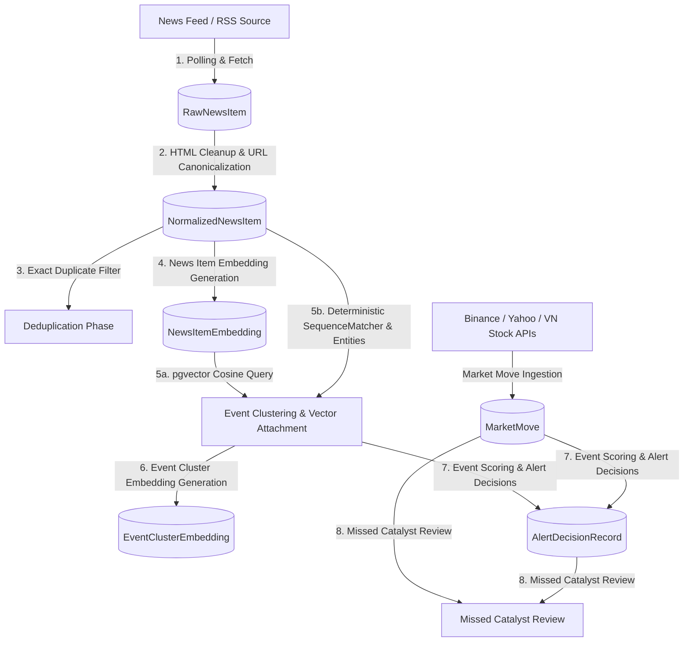

# `market-watch-bot` MVP v2 - Implementation Recap & Progress

**Target Code Base State / Commit ID**: `ef367fd4803da562f8a5996d313c739a1f2e0b48`

The `market-watch-bot` is designed as a standalone background service and CLI worker responsible for collecting market data and news signals, normalizing articles, grouping them into market events, scoring them, and determining whether to issue alerts. 



---

## 1. Core Component Layering

The codebase is organized into several cohesive modules located inside `bot_worker/`:

*   **`bot_worker/db/models.py`**: Defines the SQLAlchemy relational mapping (Postgres + `pgvector` compatibility) of the core schema.
*   **`bot_worker/services.py`**: Contains the main pipeline orchestration (`run_pipeline`), embedding query helpers, and database transaction logic.
*   **`bot_worker/cli.py`**: A `typer`-based CLI orchestrating all administration commands.
*   **`bot_worker/normalize.py`**: Content cleanup, timestamp formatting, and query-param-aware URL canonicalization.
*   **`bot_worker/rss.py`**: XML parsing adapters for polling standard RSS news feeds.
*   **`bot_worker/watchlist.py`**: Fast case-insensitive substring searching to detect watchlist matches in headlines.
*   **`bot_worker/events.py`**: Contains clustering logic (deterministic text SequenceMatcher) and vector similarity compatibility matching (`is_vector_cluster_attachable`) to group news items.
*   **`bot_worker/embeddings.py`**: Generates vector embeddings (local character-hash modeling or remote OpenRouter `text-embedding-3-large`) and manages clustering settings.
*   **`bot_worker/market_data.py`**: Adapters for crypto (Binance/CoinGecko), global equities (Yahoo Finance), and local stocks (Vietnam stock endpoints).
*   **`bot_worker/catalysts.py`**: Scoring formulas and windowing checks linking events to high Z-score price movements.
*   **`bot_worker/scoring.py`**: Weight formulas for calculating event confidence, urgency, relevance, and final alert decisions.
*   **`bot_worker/logging.py`**: Custom rotation logic limits log file length to `max_lines` (default `10000`).
*   **`bot_worker/retention.py`**: Age-based database cleaning jobs.

---

## 2. Step-by-Step Pipeline Execution Flow

When `market-watch pipeline run` executes, it triggers `run_pipeline(session, ...)`, which sequentially coordinates **7 primary stages**:

### Stage 1: News Source Polling
1. Reads active `NewsSource` records from the database.
2. Performs asynchronous HTTP requests to parse their XML feeds via `rss.py`.
3. Hashes parsed elements (`title + description + url`) to create a `content_hash`.
4. Saves new items into `RawNewsItem` (skipping duplicates using a database `UniqueConstraint` on `(source_id, content_hash)`).
5. Writes duration, fetch counts, and outcome status into `SourceFetchLog`.

### Stage 2: Normalization
1. Selects pending `RawNewsItem` rows.
2. Normalizes text via `normalize_text()` by stripping HTML tags, unescaping entities, collapsing multi-whitespaces, and formatting to `NFKC` unicode.
3. Canonicalizes URLs via `canonicalize_url()` by standardizing schemes, lower-casing domain paths, and filtering out common tracking query parameters (e.g., `utm_source`, `fbclid`).
4. Converts publication timestamps to timezone-aware UTC and filters out items older than `freshness_hours` (e.g., `168` hours).
5. Inserts standardized records into `NormalizedNewsItem` with processing status `"normalized"`.

### Stage 3: Exact Deduplication
1. Compares newly normalized articles.
2. Identifies exact duplicates using `(canonical_url_hash, title_hash)` signatures.
3. Marks duplicate records with the status `"deduped"` to avoid redundant embedding generation and downstream clutter while retaining records for event volume computation.

### Stage 4: Generating News Embeddings
If an embedding configuration is provided (e.g., `openrouter` or `local` provider):
1. Builds a textual context from normalized titles, snippets, source name, matched entities, and asset categories.
2. Generates a 1536-dimension representation:
   * **`OpenRouterEmbeddingProvider`**: Sends HTTP batches using OpenAI’s `text-embedding-3-large`.
   * **`LocalEmbeddingProvider`**: A fully offline-first character hash model that yields normalized vector coordinates, allowing unit testing and execution without internet access.
3. Stores vector values in `NewsItemEmbedding` using Postgres `pgvector` features.

### Stage 5: Event Clustering & Vector Attachment
If an embedding config is provided and `cluster_attach_enabled` is `true`, the pipeline first attempts to attach news items directly to existing clusters via vector similarity:
1. **Vector-based Search**: Queries `event_cluster_embeddings` using the incoming item's embedding and `pgvector` cosine similarity (`1 - (ece.vector <=> query_vector)`).
2. **Recent Window Gate**: Looks up recent event clusters matching a configurable lookback window (`cluster_attach_lookback_days`, default 7 days) up to a candidate limit (`cluster_attach_candidate_limit`, default 20).
3. **Strict Compatibility Checks**: Evaluates each candidate using `is_vector_cluster_attachable` which ensures:
   * Similarity is at or above the minimum (`cluster_attach_min_similarity`, default 0.88).
   * Geographic region is compatible (e.g., direct overlap or fallback to/from "global").
   * Asset classes overlap (if both candidate and item define asset classes).
   * Watchlist entities overlap (if both define entities).
4. **Merge & Rescore**: If a compatible cluster is found, the item is attached. The pipeline:
   * Adds the `EventClusterItem` mapping with a calculated percentage `similarity_score`.
   * Merges and sorts regions, asset classes, and entities.
   * Increments `source_count`, updates `top_source_score`, and recalculates event/alert scores.
   * Purges the stale `EventClusterEmbedding` record (so Stage 6 can regenerate it with updated contexts).
5. **Deterministic Fallback**: If vector attachment is disabled or no candidates match, it performs a local entity extraction match using `WatchlistEntity` (Tiers A, B, C, D) and falls back to the high-efficiency deterministic `SequenceMatcher` algorithm (title similarity ratio $\ge 0.45$, overlapping entities, and region/asset compatibility) to form new `EventCluster` drafts.

### Stage 6: Generating Event Embeddings
If embedding configuration is provided:
1. Scans for new `EventCluster` records or updated clusters with missing/purged embeddings.
2. Formulates an embedding context (canonical headline, summary, affected entities, regions, and asset classes).
3. Generates 1536-dimension representations via OpenRouter or Local providers.
4. Stores the generated vectors in the `EventClusterEmbedding` table.

### Stage 7: Event Scoring & Alert Decisions
1. Runs `record_alert_decisions` to evaluate new or newly-updated clusters against real-world market pricing.
2. Locates matching `MarketMove` records within a $\pm24\text{-hour}$ event window.
3. Aggregates categories in `scoring.py` to calculate a dynamic `final_score` ($0$ to $100$):
   * **Source Weight (25%)**: Trustworthiness score of the highest-rated source reporting the event.
   * **Impact Weight (20%)**: Default base impact based on source score.
   * **Relevance Weight (25%)**: Multiplier mapped to watchlist tiers: **Tier A** (95), **Tier B** (75), **Tier C** (55), and **Tier D** (35).
   * **Novelty Weight (10%)**: Boosts fresh events (+85) vs. highly repeated events (+20).
   * **Urgency Weight (10%)**: High urgency assigned if the source reliability and watchlist tier are both high.
   * **Market Move Weight (10%)**: Incorporates real-world asset price movements.
   * **Confidence Weight (10%)**: Increments with source count and event status.
   * **Penalties**: Deduplication (-30), staleness (-25), and noise (-10).
   * **Catalyst Boost**: If `source_score` is $\ge 65$ and `market_move_score` is $\ge 70$, the final score is promoted to $\ge 80$.
4. Selects alert dispatch level based on configured thresholds:
   * **`final_score >= 80`**: `immediate_alert` (high impact, e.g., Telegram, Webhook).
   * **`final_score >= 55`**: `watchlist_batch` (aggregated updates).
   * **`final_score >= 30`**: `daily_digest` (archived for standard digests).
   * **`final_score < 30`**: `archive_only` (stored silently in database).
5. Writes output records into `AlertDecisionRecord`.

---

## 3. Supplementary Bot Workflows

### A. Missed Catalyst Detection
Runs `run_missed_catalyst_review` via `market-watch catalyst review`. It scans the `MarketMove` table for price changes scoring $\ge 70$. If no clustered event exists in the database within a $\pm24\text{-hour}$ window targeting that asset symbol, it flags a pending `MissedCatalystReview` record. This allows human or agent operators to detect important news signals missed by existing source feeds.

### B. Dynamic Log Rotation
As implemented in `bot_worker/logging.py`, a customized subclass of Python's rotating file handler (`LineRotatingFileHandler`) monitors log growth based on a line count threshold (`max_lines: 10000`) rather than arbitrary byte boundaries.

### C. Age-Based Data Retention
Scans table entries and applies cutoffs configured in `settings.yml` (e.g., source fetch logs deleted after 14 days, raw news items deleted after 60 days, and alert decisions kept for 365 days) via `run_retention` commands to keep database overhead lean.

---

## 4. Current DB Relational Layout

```
                  ┌───────────────┐
                  │  NewsSource   │◄──────────────┐
                  └──────┬────────┘               │
                         │                        │
             ┌───────────┴───────────┐            │
             ▼                       ▼            │
     ┌───────────────┐       ┌───────────────┐    │
     │SourceFetchLog │       │  RawNewsItem  │    │
     └───────────────┘       └───────┬───────┘    │
                                     │            │
                                     ▼            │
                             ┌───────────────┐    │
                             │NormalizedItem ├────┘
                             └──────┬─┬──────┘
                                    │ │
             ┌──────────────────────┘ └──────────────────────┐
             ▼                                               ▼
     ┌───────────────┐                               ┌───────────────┐
     │NewsItemEmbed  │                               │  NewsEntity   │
     └───────────────┘                               └───────────────┘
                                                             │
      ┌───────────────┐                                      ▼
      │  MarketMove   │                              ┌───────────────┐
      │  Timestamp    ├─────────────────────────────►│WatchlistEntity│
      └──────┬────────┘                              └───────────────┘
             │
             │              ┌───────────────┐
             │              │ EventCluster  │◄────────┐
             │              └────┬──────┬───┘         │
             │     ┌─────────────┘      │             │
             ▼     ▼                    ▼             │
     ┌───────────────┐       ┌───────────────┐        │
     │MissedCatalyst │       │EventClusterBld│        │
     └───────────────┘       └───────────────┘        │
                                                      │
                            ┌───────────────┐         │
                            │EventScoreHist │         │
                            └───────────────┘         │
                                                      │
                            ┌───────────────┐         │
                            │EventClusterItm├─────────┘
                            └───────┬───────┘
                                    │
                                    ▼
                            [NormalizedItem]
```

---

## 5. High-Performance pgvector Indexes & Settings

### HNSW Cosine Index Support
To guarantee high-efficiency lookups in Stage 5, the latest migration (`0003_event_embedding_vector_indexes.py`) adds optimized database indexes for high-speed pgvector querying:
*   **`ix_event_cluster_embeddings_vector_hnsw_cosine`**: An HNSW index constructed on `event_cluster_embeddings(vector)` using `vector_cosine_ops` to enable rapid cosine similarity neighbor searches.
*   **`ix_event_cluster_embeddings_model_filter`**: A composite btree index on `(provider, embedding_model, embedding_version, dimensions)` to filter cluster embedding candidates rapidly before conducting vector comparisons.

### New Settings Schema (`settings.yml`)
The `embeddings` configuration has been enriched with the following hyperparameters to tune the precision and lookback parameters of the vector attachment stage:
```yaml
embeddings:
  cluster_attach_enabled: true             # Enable/disable vector-based attachment
  cluster_attach_lookback_days: 7          # Max age of existing clusters to scan
  cluster_attach_min_similarity: 0.88      # Strict cosine similarity cutoff (e.g., >= 0.88)
  cluster_attach_candidate_limit: 20       # Max candidate clusters to evaluate for compatibility
```

---
## 6. Comprehensive State Review & Gap Analysis

This section evaluates the current state of the `market-watch-bot` implementation against the original architectural specifications and target CLI command manual.

### 6.1 Architectural & Data Pipeline Review

The `market-watch-bot` has a robust foundation with **Stage 1 to 7** pipeline steps mostly operational. However, some key structural boundaries—particularly **LLM integration**, **agentic investigation**, and **alert delivery channels**—are either missing or only scaffolded.

#### Data Pipeline Ingestion & Normalization
| Brief Component | Code Implementation Status | File Location / Reference | Gaps & Missing Features |
| :--- | :--- | :--- | :--- |
| **Source Registry** | **Implemented** | [models.py](../market-watch-bot/bot_worker/db/models.py#L55) | Fully models properties like `source_score`, `enabled`, and `polling_interval_seconds`. |
| **RSS Collector** | **Implemented** | [rss.py](../market-watch-bot/bot_worker/rss.py) | Standard RSS/XML polling. No support yet for custom API collectors or crawlers. |
| **Raw Ingestion Store** | **Implemented** | [models.py](../market-watch-bot/bot_worker/db/models.py#L94) | `RawNewsItem` stores JSON payload + `content_hash` unique constraints to skip exact duplicate raw fetches. |
| **Normalizer** | **Implemented** | [normalize.py](../market-watch-bot/bot_worker/normalize.py) | Strips tracking queries (`utm_*`), cleans HTML, lowercases urls, converts dates to UTC, and applies unicode `NFKC` normalization. |
| **Exact Deduper** | **Implemented** | [services.py](../market-watch-bot/bot_worker/services.py#L596) | Filters exact duplicates using unique `(canonical_url_hash, title_hash)` signatures, updating status to `"deduped"`. |
| **Entity Extractor** | **Partially Implemented** | [watchlist.py](../market-watch-bot/bot_worker/watchlist.py), [services.py](../market-watch-bot/bot_worker/services.py#L779) | Maps matching terms using watchlist dictionaries and alias lists. **Missing**: LLM-based entity extraction for complex or ambiguous texts. |
| **Vector Embeddings** | **Implemented** | [embeddings.py](../market-watch-bot/bot_worker/embeddings.py) | Connects via `OpenRouter` (`text-embedding-3-large`) or falls back to an offline-first character hash provider for local dry-runs and unit testing. |
| **Event Clustering** | **Implemented** | [events.py](../market-watch-bot/bot_worker/events.py), [services.py](../market-watch-bot/bot_worker/services.py#L779) | Groups matching elements via cosine similarity query inside Postgres `pgvector` with btree filters and HNSW indexing, fallback to a local deterministic `SequenceMatcher`. |
| **Market Data Join** | **Implemented** | [market_data.py](../market-watch-bot/bot_worker/market_data.py), [catalysts.py](../market-watch-bot/bot_worker/catalysts.py) | Ingests Binance (crypto), Yahoo Chart (global tickers), and dedicated Vietnamese stock endpoints to score price moves ($\ge 70$). Joins news within a $\pm24$-hour event window. |
| **Scoring Engine** | **Implemented** | [scoring.py](../market-watch-bot/bot_worker/scoring.py) | Math breakdown based on source, impact, relevance, novelty, urgency, market move, and confidence weights, with penalties. Promotes to $\ge 80$ when `source_score` $\ge 65$ and `market_move_score` $\ge 70$. |
| **Alert Decisions** | **Partially Implemented** | [scoring.py](../market-watch-bot/bot_worker/scoring.py#L88), [services.py](../market-watch-bot/bot_worker/services.py#L1140) | Determines alert escalation level (`immediate_alert`, `watchlist_batch`, `daily_digest`, `archive_only`) and writes it into `AlertDecisionRecord`. |
| **Alert Delivery** | **Missing** | N/A | **Critical Gap**: There is **no actual alert dispatcher**. The system only writes alerts with channel `"log"` into the database. There are no Telegram, Discord, email, or webhook dispatch services implemented. |
| **Retention Jobs** | **Implemented** | [retention.py](../market-watch-bot/bot_worker/retention.py), [services.py](../market-watch-bot/bot_worker/services.py#L1392) | Standard age-based database pruning of raw logs, news, event clusters, and score histories. |
| **Agentic Investigator** | **Missing** | N/A | **Critical Gap**: The planned "Agentic Investigator" to evaluate high-value/uncertain events, unexplained price actions, or verify rumors remains entirely unwritten. No code exists for spawning LLM investigation chains. |
| **LLM Classification / Summarization**| **Missing** | N/A | The core pipeline runs strictly deterministically. The optional high-value LLM tasks (classification, event cluster summarization, and writing custom "why it matters" digests) are missing. |

### 6.2 Command Line Interface (CLI) Analysis

This section maps all commands specified in the **CLI Manual** against what is currently written in the Typer executable ([cli.py](../market-watch-bot/bot_worker/cli.py)).

#### Section 6.2.1: Lifecycle & Setup
*   `market-watch init`: **Implemented**. Writes standard runtime configurations.
*   `market-watch migrate`: **Implemented**. Triggers Alembic head upgrades and seeds starter sources.
*   `market-watch doctor`: **Implemented**. Inspects PostgreSQL connectivities, `pgvector` presence, and OpenRouter configurations.
*   `market-watch config show`: **Missing**.
*   `market-watch config set`: **Missing**.
*   `market-watch worker start`: **Partially Implemented**. Triggers a simple loop executing `run_pipeline` synchronously every `polling_interval_seconds` in the foreground. No daemonization, multi-process management, or supervisor integration.
*   `market-watch worker stop` / `restart`: **Missing**.
*   `market-watch worker status`: **Placeholder/Deferred**. Returns `"worker status: command-driven MVP; no supervisor state recorded"`.
*   `market-watch worker logs`: **Placeholder/Deferred**. Prints `"worker logs are stdout/stderr in MVP"`.
*   `market-watch worker health`: **Implemented**. Redirects to `health pipeline`.

#### Section 6.2.2: Source Management
*   `market-watch source add`: **Implemented**. Adds a source configuration into `NewsSource`.
*   `market-watch source list`: **Implemented**. Lists registered sources and enabled state.
*   `market-watch source show`: **Implemented**. Prints source parameters in JSON format.
*   `market-watch source test`: **Implemented**. Fetches one source once and echoes items without writing to the database.
*   `market-watch source fetch`: **Implemented** (alias of `source test`).
*   `market-watch source enable`: **Implemented**. Enabler flag toggling.
*   `market-watch source disable`: **Implemented**. Disabler flag toggling.
*   `market-watch source purge`: **Implemented**. Destructive purge operation requiring the explicit `--yes` confirmation.
*   `market-watch source import`: **Implemented**. Parses a local YAML source structure and seeds the DB.
*   `market-watch source export`: **Implemented**. Writes active DB source registries back to a YAML document.

#### Section 6.2.3: Job & Pipeline Execution
*   `market-watch job list`: **Implemented**. Lists core job pipeline identifiers.
*   `market-watch job run`: **Partially Implemented**. Only supports `"pipeline"` and `"retention_cleanup"`. All other jobs trigger a deferred placeholder: `"direct implementation is deferred in MVP"`.
*   `market-watch job history`: **Placeholder/Deferred**. Echoes `"job history is stored in job_runs; use database queries for detailed MVP inspection"`.
*   `market-watch job failures` / `retry`: **Placeholder/Deferred** / **Missing**.
*   `market-watch pipeline run`: **Implemented**. Orchestrates the 7 stages synchronously and prints JSON outcome. Includes a mock `--dry-run` branch.
*   `market-watch pipeline inspect`: **Placeholder/Deferred**. Prints `"Pipeline inspection for {item} is available after database ingestion"`.
*   `market-watch pipeline stats`: **Implemented**. Redirects to `health pipeline`.
*   `market-watch pipeline replay`: **Missing**.

#### Section 6.2.4: News & Events Browsing
*   `market-watch news list`: **Placeholder/Deferred**.
*   `market-watch news show`: **Placeholder/Deferred**.
*   `market-watch news search`: **Placeholder/Deferred**.
*   `market-watch news similar`: **Missing**.
*   `market-watch news entities`: **Missing**.
*   `market-watch event list`: **Implemented**. Lists recent clusters and their final scores.
*   `market-watch event show`: **Placeholder/Deferred**.
*   `market-watch event search` / `similar` / `split` / `recluster`: **Missing**.
*   `market-watch event merge` / `rescore` / `mark`: **Placeholder/Deferred**.

#### Section 6.2.5: Watchlist & Alert Policies
*   `market-watch watchlist add`: **Implemented**. Creates a standard tracking pattern in `WatchlistEntity`.
*   `market-watch watchlist list`: **Implemented**. Queries tracked items.
*   `market-watch watchlist match`: **Implemented**. Runs substring evaluations against inputs to identify overlapping ticker assets.
*   `market-watch watchlist show` / `update` / `remove` / `import` / `export`: **Missing**.
*   `market-watch alert policy show`: **Implemented**. Prints configured score thresholds.
*   `market-watch alert policy set`: **Placeholder/Deferred**. Echoes `"persistent edit is manual in MVP"`.
*   `market-watch alert policy reset`: **Placeholder/Deferred**. Echoes `"Alert policy reset uses defaults from settings.yml"`.
*   `market-watch alert test`: **Implemented**. Feeds scores to the scoring decision engine and echoes outcomes.
*   `market-watch alert list`: **Implemented**. Lists documented decisions from `AlertDecisionRecord`.
*   `market-watch alert show`: **Implemented**. Prints full detail JSON blocks for alert records.
*   `market-watch alert send-test` / `suppress` / `unsuppress`: **Missing**.

#### Section 6.2.6: Digests, Vectors, LLM & Agents
*   `market-watch digest preview`: **Implemented**. Generates cluster summaries in chronological groups.
*   `market-watch digest build`: **Implemented**. Groups news within structured dates or UTC windows.
*   `market-watch digest send`: **Missing**. (No actual email/Telegram delivery services).
*   `market-watch digest history`: **Placeholder/Deferred**.
*   `market-watch vector status`: **Missing** (scaffolded in `embedding backfill` namespace).
*   `market-watch vector embed` / `reembed`: **Missing** (scaffolded as `embedding backfill --kind news` or `events`).
*   `market-watch vector search` / `rebuild` / `stats`: **Missing**.
*   `market-watch llm classify` / `summarize` / `score` / `test` / `usage`: **Missing** (LLM namespace is entirely absent).
*   `market-watch investigate event` / `asset` / `move` / `pending` / `show`: **Missing** (Investigate namespace is entirely absent).
*   `market-watch market source add` / `list` / `move` / `movers` / `join`: **Missing** (Only `market fetch` exists, no source registry or market mover list tools).
*   `market-watch review missed` / `list` / `show` / `resolve`: **Missing** (Only `catalyst review` exists, no command review interface).
*   `market-watch retention show` / `preview` / `run`: **Implemented**.
*   `market-watch retention set` / `vacuum`: **Missing**.
*   `market-watch health sources` / `jobs` / `db` / `pipeline`: **Implemented**.
*   `market-watch health alerts`: **Missing**.
*   `market-watch import` / `export` / `backup` (root commands): **Missing**.

### 6.3 Detailed CLI Gap Matrix

The following matrix shows all commands defined in [market-watch-bot-cli-manual.md](market-watch-bot-cli-manual.md) compared with the actual implementation in [cli.py](../market-watch-bot/bot_worker/cli.py).

| CLI Namespace | Action Command | Actual Implementation Status | Detailed Implementation Details |
| :--- | :--- | :--- | :--- |
| **init** | N/A | **Implemented** | Creates configuration default templates. |
| **migrate** | N/A | **Implemented** | Invokes Alembic and seeds initial feeds. |
| **doctor** | N/A | **Implemented** | Checks Postgres connectivity, pgvector, and OpenRouter keys. |
| **config** | `show` / `set` | **Missing** | Configuration adjustments must be done manually in `settings.yml`. |
| **worker** | `start` | **Partially Implemented** | Synchronous while-sleep loop in foreground. No supervisor backend. |
| | `stop` / `restart` | **Missing** | N/A. Requires manual terminal termination (Ctrl+C). |
| | `status` | **Placeholder** | Hardcoded text reporting command-driven MVP state. |
| | `logs` | **Placeholder** | Directs user to inspect stdout/stderr. |
| | `health` | **Implemented** | Forwards execution to health pipeline queries. |
| **source** | `add` / `list` / `show` | **Implemented** | Creates, list, and shows active news feeds. |
| | `test` / `fetch` | **Implemented** | Connects to URLs and outputs parsed elements without saving them. |
| | `enable` / `disable` | **Implemented** | Standard active/inactive flag toggling. |
| | `purge` | **Implemented** | Cleans all cascading logs/news items/events relating to a source. |
| | `import` / `export` | **Implemented** | Direct YAML serializations/deserializations. |
| **job** | `list` | **Implemented** | Lists supported jobs in `CORE_JOBS`. |
| | `run` | **Partially Implemented** | Only pipeline and retention jobs execute. Others return MVP deferred warnings. |
| | `show` / `enable` / `disable` | **Missing** | N/A. |
| | `history` / `failures` / `retry` | **Placeholder / Missing**| Database holds histories, but command interactions are missing. |
| **pipeline** | `run` | **Implemented** | Executes the complete 7-stage engine. |
| | `replay` | **Missing** | Replaying raw records through modified parsers is missing. |
| | `inspect` | **Placeholder** | Hardcoded text saying it is only available post-ingestion. |
| | `stats` | **Implemented** | Redirects to pipeline health lists. |
| **news** | `list` / `show` / `search` | **Placeholder** | N/A. |
| | `similar` / `entities` | **Missing** | N/A. |
| **event** | `list` | **Implemented** | Prints event clusters ordered by score. |
| | `show` | **Placeholder** | N/A. |
| | `search` / `similar` | **Missing** | N/A. |
| | `merge` / `rescore` / `mark` | **Placeholder** | Override tools are not implemented. |
| | `split` / `recluster` | **Missing** | N/A. |
| **watchlist** | `add` / `list` / `match` | **Implemented** | Creates tracking assets and tests substring matchers. |
| | `show` / `update` / `remove` | **Missing** | N/A. |
| | `import` / `export` | **Missing** | N/A. |
| **alert** | `policy show` | **Implemented** | Echoes configured thresholds. |
| | `policy set` / `reset` | **Placeholder** | Alerts settings remain manual edits. |
| | `test` | **Implemented** | Returns decision mapping for arbitrary scores. |
| | `list` / `show` | **Implemented** | Inspects documented alert histories. |
| | `send-test` | **Missing** | Actual communication pipelines are missing. |
| | `suppress` / `unsuppress` | **Missing** | Topic / event suppression controls are missing. |
| **digest** | `build` / `preview` | **Implemented** | Structures chronological event lists. |
| | `send` | **Missing** | Direct dispatch mechanism is missing. |
| | `history` | **Placeholder** | N/A. |
| **vector** | (all actions) | **Missing** | Represented only by the `embedding backfill` commands. |
| **llm** | (all actions) | **Missing** | Namespace completely absent in CLI. |
| **investigate**| (all actions) | **Missing** | Namespace completely absent in CLI. |
| **market** | `fetch` | **Implemented** | Fetches Binance/CG/VN stock info and writes to `market_moves`. |
| | `source add` / `source list` | **Missing** | N/A. |
| | `move` / `movers` / `join` | **Missing** | N/A. |
| **review** | (all actions) | **Missing** | Substituted by `catalyst review`, missing review resolution commands. |
| **retention** | `show` / `preview` / `run` | **Implemented** | Shows policies, estimates deletions, and runs cleanups. |
| | `set` / `vacuum` | **Missing** | N/A. |
| **health** | `sources` / `jobs` / `db` / `pipeline` | **Implemented** | Custom system status indicators. |
| | `alerts` | **Missing** | N/A. |
| **backup** | (all actions) | **Missing** | N/A. |

### 6.4 Key Takeaways & Recommendations

1.  **Stunning Core Mechanics**: The implementation of standard normalization, URL canonicalization, exact deduplication, `pgvector` indexing, and deterministic event clustering is highly thorough and robust.
2.  **Scoring & Joined Market Data**: Stage 7 successfully integrates scored price movement cataloging, and ties event scores to real-world volatility, which is very premium and well done.
3.  **Critical Gaps for Next Phase**:
    *   **Alert Delivery Channels**: Currently, the bot records an alert decision record, but has no actual delivery mechanism (e.g. sending a Telegram message, posting to a Discord webhook, or sending a digest email). 
    *   **LLM Judgment / Summarization**: The pipeline operates deterministically. High-value agentic integrations (such as writing structured summaries of clusters or drafting "Why it matters" alerts) need to be added using the OpenRouter client.
    *   **Agentic Investigator / Missed Catalyst Resolution**: Commands and services for triggerable LLM research loops (e.g. investigating price movements with no obvious news source) are missing.
    *   **Supervisor Daemon**: The worker runs as a foreground Typer task with a while-sleep loop. For Docker compose and production deployments, a formal scheduler (e.g., Celery, APScheduler, or a structured asyncio scheduler daemon) will be more robust.


