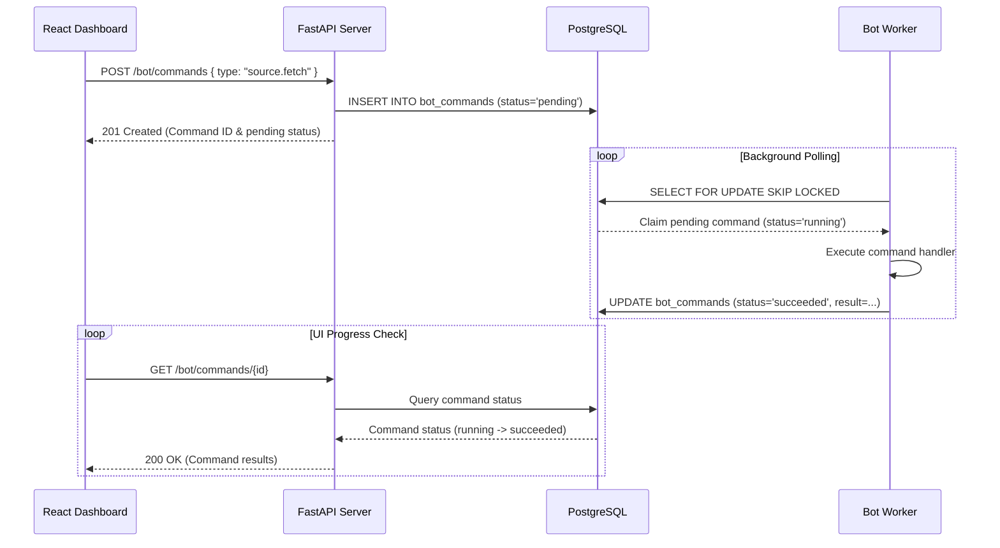

# FastAPI API Server Overview

**Last Updated:** June 14, 2026  
**Latest Commit:** `808545f9080fe9d4fce526e2730aa1366c98e668`

---

## 1. Introduction
The **API Server** ([api_server](../market-watch-bot/api_server)) is the FastAPI control and data access layer. It exposes route groups for querying system states (news, events, alert decisions, watchlists, maintenance stats) and mutating configurations.

---

## 2. API Security & Write Authentication
The API server includes a middleware configuration in [main.py](../market-watch-bot/api_server/app/main.py) to secure state-modifying endpoints:

- **Read Operations (`GET`)**: Open and fast, allowing dashboard UI components to pull data without credentials.
- **Mutating Operations (`POST`, `PATCH`, `PUT`, `DELETE`)**: Guarded by an HTTP middleware requiring a Bearer Authentication token matching the backend `API_AUTH_TOKEN` (configured in `.env`). A missing token yields `401 Unauthorized`, an invalid token `403 Forbidden`, and an unconfigured server-side `API_AUTH_TOKEN` `503 Service Unavailable`.
- **CORS**: Configured from `api_cors_origins` plus a regex allowing `localhost`/LAN origins on port `5173` (the Vite dev/dashboard port), with credentials enabled.

---

## 3. Decoupled Processing Pipeline
A strict architectural rule is that HTTP handlers **must not block on worker pipelines** during HTTP cycles. Doing so would lead to HTTP timeouts due to the latency of third-party LLM and Web Search calls.

Instead, when an action is requested (e.g. testing an alert channel, reclustering news, running an investigation), the route handler inserts a `BotCommand` record into the database:

---

## 4. API Route Groups
API routes are split under the [routers](../market-watch-bot/api_server/app/api/routers) directory:

All routers are mounted at the root (there is **no** global `/api` prefix); each route declares its own path, e.g. `/bot/commands`.

| Route Group | Path Prefix | Description |
| :--- | :--- | :--- |
| **Health Router** | `/health`, `/ready` | Liveness and readiness probes used by Docker healthchecks ([health.py](../market-watch-bot/api_server/app/api/routers/health.py)). |
| **Bot Router** | `/bot` | Queue, list, cancel commands, and check the current worker run status ([bot.py](../market-watch-bot/api_server/app/api/routers/bot.py)). |
| **Jobs Router** | `/jobs` | Inspect background `JobRun` history and execution outcomes ([jobs.py](../market-watch-bot/api_server/app/api/routers/jobs.py)). |
| **News Router** | `/news` | Browse normalized news items, query domains, and view entity tags ([news.py](../market-watch-bot/api_server/app/api/routers/news.py)). |
| **Events Router** | `/events` | Timelines, details, score history, an SSE live stream (`/events/stream`), and manual recluster/split/merge triggers ([events.py](../market-watch-bot/api_server/app/api/routers/events.py)). |
| **Alerts Router** | `/alerts` | Alert decisions, acknowledge/dismiss, plus alert channels and suppression rules ([alerts.py](../market-watch-bot/api_server/app/api/routers/alerts.py)). |
| **Digests Router** | `/digests` | Preview and inspect aggregated daily/weekly digest records ([digests.py](../market-watch-bot/api_server/app/api/routers/digests.py)). |
| **Market Router** | `/market` | Query recorded market moves and price-action windows ([market.py](../market-watch-bot/api_server/app/api/routers/market.py)). |
| **Investigations Router** | `/investigations` | List agentic investigation runs and their synthesized findings ([investigations.py](../market-watch-bot/api_server/app/api/routers/investigations.py)). |
| **Watchlist Router** | `/watchlist` | Create, update, and delete watch entries and symbols ([watchlist.py](../market-watch-bot/api_server/app/api/routers/watchlist.py)). |
| **Settings Router** | `/settings` | Read/update the alert policy and scoring presets ([settings.py](../market-watch-bot/api_server/app/api/routers/settings.py)). |
| **Sources Router** | `/sources` | Manage news sources, trigger fetches, and preview article text extraction ([sources.py](../market-watch-bot/api_server/app/api/routers/sources.py)). |
| **Maintenance Router** | `/maintenance` | Pull metrics, view LLM tokens and costs, audit embeddings coverage, and review logs ([maintenance.py](../market-watch-bot/api_server/app/api/routers/maintenance.py)). |
