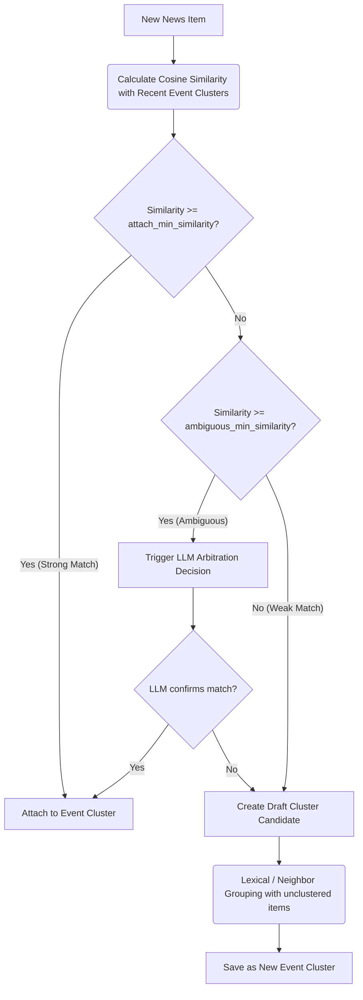

# Bot Worker & Ingestion Pipeline Overview

**Last Updated:** June 14, 2026  
**Latest Commit:** `808545f9080fe9d4fce526e2730aa1366c98e668`

---

## 1. Role and Responsibilities
The **Bot Worker** ([bot_worker](../market-watch-bot/bot_worker)) is a standalone background service and command-line interface (CLI) package built on Typer. It is responsible for all heavy lifting, scheduled data processing, external API requests, and agentic workflows.

---

## 2. In-Database Decoupled Command execution
The Bot Worker continuously runs a background loop when started with `market-watch worker start`. 
- It polls the `bot_commands` table for tasks in `pending` status using `process_pending_bot_commands()` in [bot_commands.py](../market-watch-bot/bot_worker/services/bot_commands.py).
- A row lock (`SELECT FOR UPDATE SKIP LOCKED`) ensures concurrent worker processes do not execute the same command.
- Once claimed, the worker updates the command status to `running`, runs the job synchronously, and saves the final result/error message.

---

## 3. The 12-Stage Ingestion Pipeline
The core data ingestion workflow is implemented in [pipeline.py](../market-watch-bot/bot_worker/services/pipeline.py) and executes the following stages sequentially:

### Stage 1: Polling News Sources
Pulls feed items from RSS feeds and custom crawlers defined in `NewsSource`. It tracks fetched content hashes to skip duplicate requests and manages individual source error count limits.

### Stage 2: Normalizing Raw Items
Implemented in [ingestion.py](../market-watch-bot/bot_worker/services/ingestion.py). It parses titles, snippets, publication dates, and source properties, standardizing language and region tags.

### Stage 3: Deduplicating News Items
Checks exact duplicates by comparing URL and text hashes, marking duplicates in the database to prevent duplicate downstream LLM or embedding runs.

### Stage 4: Extracting Full Text
Runs [full_text.py](../market-watch-bot/bot_worker/services/full_text.py) to resolve full article content for RSS items that only contain snippets, utilizing site crawlers or fallback readers.

### Stage 5: Extracting News Entities
Uses LLM models to identify organizations, companies, exchanges, and ticker symbols mentioned in the news items.

### Stage 6: Generating News Embeddings
Queries the configured embedding provider (e.g. local or OpenRouter) to write 1536-dimensional vector representations to `news_item_embeddings`.

### Stage 7: Building Event Clusters
Groups news items into distinct events using a hybrid lexical-vector clustering algorithm (see Section 4).

### Stage 8: Generating Event Embeddings
Computes the vector representation of new event clusters by calculating their contextual embeddings.

### Stage 9: LLM Event Enrichment
Enriches clusters via [llm.py](../market-watch-bot/bot_worker/services/llm.py) to refine titles, write summaries, and identify major catalysts.

### Stage 10: Fetching Market Moves
Retrieves market changes for watchlisted assets and asset classes — Vietnam equities/indices (VN market service), crypto pairs (CoinGecko/Binance), and global instruments (Hyperliquid) — using [market.py](../market-watch-bot/bot_worker/services/market.py).

### Stage 11: Recording Alert Decisions
Scores events, decides whether to alert or suppress, schedules agentic investigations, and dispatches immediate Telegram alerts.

### Stage 12: Missed Catalyst Review
Checks for significant market price movements that lack corresponding news events, generating missed catalyst review jobs to prevent signal blindness.

---

## 4. Hybrid Event Clustering Engine
Event clustering ([events.py](../market-watch-bot/bot_worker/services/events.py)) routes news items through a multi-tier logic gate:

1. **Cosine Threshold Gate**: If the cosine similarity with an existing cluster (within the `cluster_attach_lookback_days` window, default `7`) meets the `cluster_attach_min_similarity` (default `0.88`), it is appended.
2. **LLM Arbitration Gate**: If similarity falls in the gray zone (≥ `cluster_ambiguous_min_similarity`, default `0.78`, but below the attach threshold), `resolve_llm_cluster_decision` queries the LLM to inspect entity and summary overlaps, attaching only when it returns at least `cluster_decision_min_confidence` (default `70`).
3. **Lexical/Neighbor Grouping**: If completely unattached, the item is matched against other items in the batch using shared entity tags and local vectors to spawn a new cluster.

---

## 5. Agentic Investigations
Implemented in [investigation.py](../market-watch-bot/bot_worker/services/investigation.py), the worker triggers a deep-dive investigation when:
- An event cluster's score indicates high importance but low confidence.
- A market move is flagged under the Missed Catalyst Review stage.

### Investigation Steps:
1. **Evidence Gathering**: Queries the database for local news items. If `BRAVE_SEARCH_API_KEY` is configured, it runs web search queries to fetch official filings, regulator updates, and announcements.
2. **Result Ranking**: Deduplicates and ranks evidence, prioritizing official and high-quality domains.
3. **LLM Synthesis**: Submits gathered evidence and event snapshots to the LLM. The LLM produces a structured summary of causes and suggests a **score modifier** (clamped to `-10`..`+10`) to correct potential scoring errors.
