# Market Watch Assistant - Architecture & Component Overview

**Last Updated:** June 19, 2026  
**Latest Commit:** `24f74c0fa88230d741f8b0397cb4056776c4614d`

## 1. Introduction
The **Market Watch Assistant** is a personal market watch system designed to collect, process, and analyze financial signals across global, Vietnam, and cryptocurrency markets. The system groups news items into market events, scores them, decides whether to alert the user, and presents all data and configuration options through a responsive React dashboard.

### Major Component Documentation
For detailed architectural logs and descriptions of each component, refer to the dedicated overview documents:
- [Bot Worker & Ingestion Pipeline](./bot_worker.md): The background queue processing loop, 12-stage ingestion pipeline, pgvector-based hybrid clustering engine, dynamic scoring, and agentic Brave search investigations.
- [FastAPI API Server](./api_server.md): FastAPI routes design, authentication middlewares, write protection logic, and decoupled queue commands.
- [React Dashboard](./dashboard.md): React 19 single-page application structure, state management data polling hooks, and feature module layouts.
- [Database & Shared Common Layer](./common.md): SQLAlchemy declarative base tables mapping, pgvector integration, config loading, LLM tokens audit wrappers, and RSS crawl policies.

---

## 2. System Architecture & Component Interactions
Below is a high-level representation of the architecture, showing the decoupling between the FastAPI API Server, the React Dashboard, the PostgreSQL database, and the background Bot Worker.

```mermaid
graph TD
    %% Frontend
    subgraph Frontend [Client Layer]
        UI[React 19 Dashboard]
    end

    %% Web API
    subgraph WebServer [API Layer]
        API[FastAPI Server]
        Auth[Write Auth Middleware]
    end

    %% Database
    subgraph DataStore [Database Layer]
        DB[(PostgreSQL + pgvector)]
        CommandQueue[Bot Commands Queue Table]
        Heartbeat[worker.heartbeat AppSetting]
    end

    %% Backend Worker
    subgraph Worker [Bot Worker Process - Two Independent Loops]
        PipelineLoop[Pipeline Loop]
        CommandLoop[Command Loop]
        Pipeline[12-Stage Ingestion Pipeline]
        Clustering[Clustering & LLM Arbitration]
        Investigation[Agentic Investigations]
    end

    %% External Systems
    subgraph External [External Services]
        RSS[RSS Feeds & Web Crawlers]
        LLM[LLM/Embedding Provider - OpenRouter]
        Brave[Brave Search API]
        Markets[Market Data APIs - VN / Crypto / Hyperliquid]
        Telegram[Telegram Bot Channel]
    end

    %% Connections
    UI -- "HTTPS / REST (with VITE_API_AUTH_TOKEN)" --> API
    API -- "MUTATING Operations (Requires Bearer Auth)" --> Auth
    API -- "Queries & Command Inserts" --> DB
    API -- "Reads liveness/staleness" --> Heartbeat

    CommandLoop -- "Drains (FOR UPDATE SKIP LOCKED)" --> CommandQueue
    PipelineLoop -- "Runs on polling interval" --> Pipeline
    PipelineLoop -- "Schedules pending" --> Investigation
    PipelineLoop & CommandLoop -- "Write liveness" --> Heartbeat
    Pipeline -- "Data read/write" --> DB

    Pipeline -- "Fetch raw news" --> RSS
    Pipeline -- "Embed & Analyze" --> LLM
    Pipeline -- "Fetch prices" --> Markets
    Pipeline -- "Dispatch notifications" --> Telegram

    Investigation -- "Web Search" --> Brave
    Investigation -- "Contextual Analysis" --> LLM
```

### Decoupled Communication via Database-Backed Queue
A key architectural design principle is **strict decoupling**:
- The **FastAPI API Server** and the **Bot Worker** run in separate processes.
- The API Server never calls worker pipelines directly during the HTTP request cycle.
- Instead, the API Server queues mutations or tasks by inserting a record into the `bot_commands` table.
- The Bot Worker continuously polls `bot_commands` for pending entries, locks them (using `SELECT FOR UPDATE SKIP LOCKED` database row locks to prevent duplicate executions), runs the execution, and saves the results/errors back to the command record.
- The worker runs the scheduled pipeline and the command drain as **two independent asyncio loops** in their own transactions, so user-issued commands stay responsive even while a long pipeline tick is in flight (no command can trigger the pipeline, so the two loops never run it concurrently).
- The worker periodically writes a `worker.heartbeat` `AppSetting`; the API server treats it as stale after 60s so the dashboard can surface worker liveness.
- The React Dashboard polls the bot status and command queue to display job execution progress to the user.

---

## 3. Database Layer & Core Models (`common/db/models.py`)
> [!NOTE]
> For a detailed guide on the common shared library, models, LLM prompts, and crawlers, see [Database & Shared Common Layer](./common.md).

The database uses PostgreSQL with the `pgvector` extension to enable vector embeddings for semantic search and event clustering. Core SQLAlchemy models include:

1. **Ingestion Core**:
   - `NewsSource`: Details about feed sources (RSS or crawling policy, category, region, polling interval, source quality scoring).
   - `SourceFetchLog`: History of feed fetch attempts, timings, success statuses, and response hashes.
   - `RawNewsItem`: The exact raw payload and content retrieved from sources.
   - `NormalizedNewsItem`: Cleaned, parsed news items with deduplication hashes (`title_hash`, `canonical_url_hash`, `normalized_text_hash`).
   - `NewsEntity`: Key entities (organizations, tickers, exchanges, locations) extracted from news items by the LLM.

2. **Event & Embedding Core**:
   - `EventCluster`: Groups of related news items representing a distinct market event. Features fields for confidence, novelty, urgency, market impact, relevance, and final scores.
   - `EventClusterItem`: Link table mapping `NormalizedNewsItem` to `EventCluster` with relationship metadata and vector similarity scores.
   - `NewsItemEmbedding` & `EventClusterEmbedding`: Stores 1536-dimensional vector representations (`pgvector` column format) for semantic grouping.
   - `EventScoreHistory`: Keeps historical records of score breakdown over time.

3. **Actions & Automation**:
   - `BotCommand`: In-database command queue storing task types (`source.fetch`, `alert.dispatch`, `event.recluster`, etc.), statuses (`pending`, `running`, `succeeded`, `failed`), inputs, and results.
   - `LLMAnalysisRun`: Cached records of LLM prompt/response pairs to avoid redundant token expenses.
   - `AgentInvestigation`: Records of deep research triggered on events or unexplained market movements using Brave search and LLM context synthesis.
   - `MarketMove` & `MissedCatalystReview`: Real-time price actions, window changes, and automatically generated review tasks for moves that don't align with any event.
   - `AlertDecisionRecord`, `AlertChannel`, `AlertSuppressionRule`, `AlertDeliveryRecord`: Handles alert delivery policy, suppressions, and Telegram dispatching.
   - `DigestRecord`: Aggregated daily/weekly updates summarising market signals.

---

## 4. Background Worker & Ingestion Pipeline (`bot_worker/`)
> [!NOTE]
> For a detailed guide on command polling, the 12-stage ingestion run, vector neighbor clustering, and agent investigations, see [Bot Worker & Ingestion Pipeline](./bot_worker.md).

The worker acts as the background system run loop and exposes a Typer CLI entry point (`market-watch`).

### The 12-Stage Ingestion Pipeline
On each scheduled worker tick, the pipeline sequentially flows through the following stages:

| Stage | Name | Description |
| :--- | :--- | :--- |
| **Stage 1** | **Polling News Sources** | Pulls news from RSS feeds and custom crawlers defined in `NewsSource`. |
| **Stage 2** | **Normalizing Raw Items** | Parses raw payloads, cleans HTML/noise patterns, and sets region/language targets. |
| **Stage 3** | **Deduplicating News Items** | Detects exact duplicates using URL and text hashing to minimize downstream processing. |
| **Stage 4** | **Extracting Full Text** | Fetches full article content for RSS summaries where detail is lacking. |
| **Stage 5** | **Extracting News Entities** | Uses LLM to identify specific organizations, locations, and ticker symbols. |
| **Stage 6** | **Generating News Embeddings** | Generates 1536-dimensional vectors via the configured embedding provider. |
| **Stage 7** | **Building Event Clusters** | Maps news items into event clusters using vector-based similarity or LLM gray-zone arbitration. |
| **Stage 8** | **Generating Event Embeddings** | Calculates vector profiles representing the combined semantic context of each cluster. |
| **Stage 9** | **LLM Event Enrichment** | Enriches clusters with title refinement, summarization, and key detail highlights. |
| **Stage 10** | **Fetching Market Moves** | Fetches market price changes for Vietnam (VN), cryptocurrency, and watchlisted assets. |
| **Stage 11** | **Recording Alert Decisions** | Computes event priority scores, schedules agent investigations, and sends alerts to Telegram. |
| **Stage 12** | **Missed Catalyst Review** | Compares market moves against known event clusters; files a review task if a significant move has no matching event. |

### Event Clustering & LLM Arbitration
Clustering is hybrid:
- **Vector Attach**: News item vectors are compared against recent `EventCluster` embeddings (default lookback `7` days) using cosine similarity. If the score meets or exceeds `cluster_attach_min_similarity` (default `0.88`), the item is attached.
- **LLM Gray-Zone Arbitration**: If the similarity falls in the ambiguous zone (between attach and `cluster_ambiguous_min_similarity`, default `0.78`), the item is sent to the LLM to decide if it matches the event cluster context (requiring `cluster_decision_min_confidence`, default `70`).
- **Lexical/Neighbor Grouping**: Unattached items are clustered together based on shared entity overlaps and vector-level similarity thresholds to spawn new drafts.

### Scoring & Alerting
Event clusters are scored dynamically (`bot_worker/scoring.py`) as a weighted blend of:
1. **Source Score**: Quality of the top news provider reporting it.
2. **Relevance**: Watchlist tier of affected entities (S=100, A=90, B=75, C=55, D=35).
3. **Confidence**: Derived from source count and the number of distinct high-quality sources.
4. **Market Move**: Real-time price move correlations (folded in when present).

Duplicate, stale, and low-quality "noise" penalties multiply down the result. The final score (0-100) routes the event through a four-tier alert decision: `immediate_alert` (≥80), `watchlist_batch` (≥55), `daily_digest` (≥30), or `archive_only`.

---

## 5. Control APIs & Dashboard Features

### FastAPI Control Layer (`api_server/`)
> [!NOTE]
> For a detailed guide on API routing architecture, CORS configuration, write security middlewares, and schemas, see [FastAPI API Server](./api_server.md).

Exposes REST endpoints configured into route groups:
- `/bot/status` and `/bot/commands`: Worker liveness (with heartbeat staleness) and the queue/poll command surface. Manual `event.recluster` / `event.split` / `event.merge` / `event.rescore` operations are issued as queued bot commands here, not as direct events endpoints.
- `/sources`: Configure and view ingestion feeds.
- `/events` and `/news`: Browse normalized data structures, including the `/events/stream` SSE feed.
- `/alerts`, `/alert-channels`, and `/alert-suppression-rules`: Acknowledge/dismiss decisions and administer Telegram links and suppression rules.
- `/watchlist`: Edit asset symbols and priority tiers.
- `/settings`: Read/update the alert policy and read scoring/configuration presets.
- `/maintenance`: Manage pipeline metrics, LLM run costs, and database retention logs.

*Security*: Mutating requests (`POST`, `PATCH`, `PUT`, `DELETE`) require a Bearer Authentication token matching the backend `API_AUTH_TOKEN`.

### React 19 Dashboard (`dashboard/`)
> [!NOTE]
> For a detailed guide on front-end components, client-side API caching wrappers, features code layout, and polling hooks, see [React Dashboard](./dashboard.md).

Built with Vite, TypeScript, Tailwind CSS, and daisyUI.
- **State Management (`src/app/state.ts` / `useDashboardData.ts`)**: Custom hooks orchestrate polling schedules to fetch the bot's health, commands queue, jobs history, and event feeds.
- **Navigation** (`src/app/navigation.ts`) exposes eight views: `overview`, `events`, `news`, `alerts`, `sources`, `watchlist`, `commands`, and `maintenance`.
- **Features Structure**:
  - `overview`: System health, worker heartbeat, daily digest, and per-segment spotlight event ranking across the global / US / Vietnam / crypto market segments.
  - `events`: Interactive clusters timeline (paginated/filtered/sorted) showing article components, scores, market moves, and active investigations.
  - `news`: Tabulated feed of raw articles, full-text extractions, and extracted entities.
  - `alerts`: Alert decisions plus a settings tab housing the alert policy, channels, and suppression rules (migrated here from the old settings/maintenance surface).
  - `watchlist`: Edit ticker associations and priority tiers.
  - `sources`: Source health trackers, check status, polling logs, and feed preview tooling.
  - `commands`: Manual command console (queue/inspect bot commands) plus command history.
  - `maintenance`: Consolidated operational tabs — pipeline metrics, fetch logs, job history, score history, embedding coverage, LLM runs/costs, missed-catalyst review, and retention audits.

---

## 6. Runtime Configuration & Management

- **Config Files**:
  - `settings.yml`: Holds non-secret defaults (polling intervals, scoring thresholds, models, and providers).
  - `.env`: Generated on initialization, stores credentials (database URLs, API keys, tokens).
- **Docker Integration**:
  - A single multi-stage `Dockerfile` builds three targets, orchestrated by `docker-compose.yml`:
    1. `bot-worker`: Runs the Typer backend worker loop (`uv run market-watch worker start`).
    2. `api-server`: Starts the FastAPI server (`uv run market-watch server start`), exposed on port `8000`.
    3. `dashboard`: Builds the React app and serves the static bundle via nginx (`5173:80`).
  - PostgreSQL is **not** a compose service; all containers connect to a shared external database via `DATABASE_URL` in `.env`. Each container has a healthcheck; `dashboard` waits for `api-server` to be healthy.
